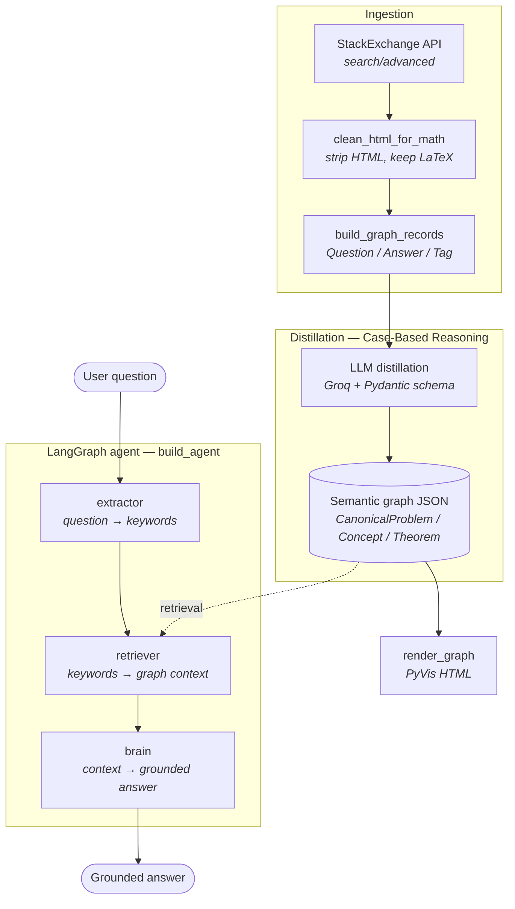
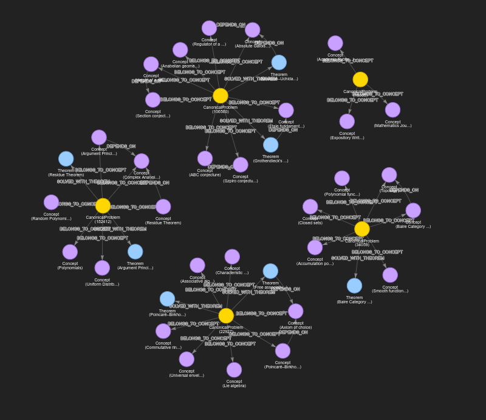

# 🧠 AI Math Assistant Agent

General-purpose LLMs often produce math answers that *look* right but skip steps, hallucinate intermediate results, or can't justify how they got from problem to answer. This project builds an assistant agent that **grounds** its reasoning instead of just asserting it — by distilling real, community-vetted solved problems into a **Semantic Knowledge Graph (Graph-CoT)**, and retrieving relevant mathematical context before the model answers.

> **Status:** Early-stage research project. The data pipeline, the Case-Based Reasoning (CBR) distillation into a semantic graph, and a working retrieval-augmented agent are implemented. The distillation pipeline still lives as a notebook prototype (`notebooks/enrichment/graph-cot.ipynb`) and has not been extracted into `src/` yet. Entity resolution, a Qdrant + Neo4j GraphRAG backend, fine-tuning, and tool calling are on the roadmap below.

---

## 🚀 Overview

The agent is built from three layers:

1. **Real, vetted data.** Accepted, highly-voted answers are pulled from math Q&A communities and cleaned while preserving their LaTeX.
2. **Distilled knowledge graph (Case-Based Reasoning).** Raw Q&A pairs are not dumped into a database as-is. They are run through an LLM distillation pass with strict Pydantic schemas, producing `CanonicalProblem` nodes (objective, math setup, solution steps) linked to the `Concept`s they belong to and the `Theorem`s they are solved with.
3. **Agentic orchestration.** A LangGraph state machine extracts keywords from the user's question, retrieves matching cases from the graph, and generates an answer grounded **only** in that structured context.

---

## 🧩 Architecture



* **Data acquisition** — `fetch_math_dataset()` pulls accepted, highly-voted answers from the StackExchange `search/advanced` API (MathOverflow / Mathematics).
* **Cleaning** — `clean_html_for_math()` strips HTML with BeautifulSoup while deliberately preserving the MathJax/LaTeX (`$...$`) inside it.
* **Raw graph** — `build_graph_records()` turns the fetched data into a backend-agnostic `{"nodes": [...], "edges": [...]}` dict of `Question` / `Answer` / `Tag` nodes. `config.METADATA_TAGS` filters out form-describing tags (`big-list`, `soft-question`, …) that would otherwise become the graph's largest — and least mathematical — hubs.
* **Distillation** — the notebook prototype calls Groq with a Pydantic JSON schema (`MathCaseExtraction`) to distill each Q&A into a `CanonicalProblem`, plus the `Concept`s and `Theorem`s it uses, wired with `BELONGS_TO_CONCEPT`, `SOLVED_WITH_THEOREM` and `DEPENDS_ON` edges.
* **Visualization** — `render_graph()` produces an interactive, physics-based PyVis map. `pyvis_renderer_v2` is the CBR-ontology variant used for the semantic graph.
* **Agent** — `build_agent(client, graph_data)` compiles a LangGraph `StateGraph` with three nodes: keyword `extractor` → graph `retriever` → answer generator (`brain`), backed by Groq.

---

## 🕸️ What the graph looks like today



Yellow nodes are `CanonicalProblem`s, purple are `Concept`s, blue are `Theorem`s. This render comes from a small 5-question batch, and the shape it produces is worth being explicit about: **the graph is currently a set of disconnected stars, not a network.** Each distilled problem sits at the center of its own concepts and theorems, and almost nothing bridges one cluster to another.

That is expected at this data volume, not a modeling failure. Shared structure only emerges once two different problems reach for the *same* concept or theorem — and with five problems drawn from unrelated corners of mathematics, overlap is essentially zero.

**With more data, the interesting part becomes the paths between the nodes.** As the corpus grows, `Concept` and `Theorem` nodes start being reused across problems, and the isolated stars fuse into a traversable network. That is what unlocks the Graph-CoT retrieval described in `docs/_01_graph_CoT.md`: the agent stops doing flat lookup and starts *navigating* — from a concept, to a theorem it depends on, to a previously solved problem that applied it. Reaching that point depends on three things, and they are the roadmap in order: ingesting substantially more Q&A pairs; the entity resolution in `docs/_02_entity_resolution.md`, without which the same concept appears under a dozen near-identical names and the bridges never form; and the Qdrant + Neo4j backend in `docs/_03_qdrant_graph_rag.md`, which is what makes traversing those bridges a database query rather than a dictionary scan.

---

## 📂 Repository structure

```text
src/math_assistant_agent/
├── config.py                  # model names, prompts, generation defaults, METADATA_TAGS
├── data/
│   ├── stackexchange.py       # fetch_math_dataset(): StackExchange API client
│   ├── cleaning.py            # clean_html_for_math(): HTML strip, LaTeX preserved
│   ├── formatting.py          # ShareGPT-style JSONL dataset formatting
│   └── graph.py               # graph build / load / save / prune / lookup helpers
├── visualization/
│   ├── pyvis_renderer.py      # render_graph(): raw Question/Answer/Tag graph
│   └── pyvis_renderer_v2.py   # render_graph(): CBR ontology colors
└── agent/
    ├── states.py              #   GraphAgentState (the shared "clipboard")
    ├── llm.py                 #   Groq client + chat-completion helper
    ├── extractor.py           #   node 1: question -> keywords
    ├── retriever.py           #   node 2: keywords -> graph context
    ├── generator.py           #   node 3: context -> grounded answer
    └── flow.py                #   build_agent(): wires the nodes into a StateGraph

scripts/mvp.py                 # fast CLI to run the agent on a single question
notebooks/
├── data/ingestion.ipynb       # fetch, clean, and build the raw graph
├── enrichment/graph-cot.ipynb # CBR distillation prototype (schema, extractor, batch run, render)
└── modeling/                  # fine-tuning and agent-v1 exploration notebooks
docs/                          # design notes and roadmap (see below)
```

Generated artifacts (`data/*.json`, notebook `outputs/`) are gitignored — you build them locally.

---

## 📚 Docs

| Doc | What it covers | Status |
| --- | --- | --- |
| [`docs/_01_graph_CoT.md`](docs/_01_graph_CoT.md) | Why the graph stores semantic knowledge (Concepts, Theorems, dependencies) rather than one answer's reasoning flow, and how the agent should navigate it | ✅ Implemented |
| [`docs/_02_entity_resolution.md`](docs/_02_entity_resolution.md) | v2.0 plan: embeddings + cosine similarity to merge semantically identical problems into a single canonical node (N:1) | 🔜 Next |
| [`docs/_03_qdrant_graph_rag.md`](docs/_03_qdrant_graph_rag.md) | v3.0 target architecture: retire the in-memory JSON for a dual store — **Qdrant** for vector search, **Neo4j** for traversal — orchestrated by `neo4j-graphrag-python` | 📋 Planned |

---

## 🛠️ Tech stack

| Layer | Tools |
| --- | --- |
| Data sourcing | StackExchange API, `requests`, `beautifulsoup4` |
| Distillation | `groq`, `pydantic` (structured JSON output) |
| Knowledge graph | Backend-agnostic JSON, `pyvis` for interactive visualization |
| Agent orchestration | `langgraph`, `langchain-core` |
| LLM provider | Groq (`openai/gpt-oss-20b`) |

---

## ⚡ Getting started

**Prerequisites:** Python ≥ 3.11. [`uv`](https://docs.astral.sh/uv/) is recommended (a `uv.lock` is committed); plain `pip` works too.

```bash
# 1. Install the package and its dependencies
uv sync                       # or:  pip install -e .

# 2. Configure API keys
cp .env.example .env          # then fill in the values you need
```

`.env` keys (see `.env.example`): `STACK_EXCHANGE_API_KEY` (data acquisition), `GROQ_API_KEY` (required by the agent).

### Build the knowledge graph

1. `notebooks/data/ingestion.ipynb` — fetch and clean Q&A pairs, build the raw `Question`/`Answer`/`Tag` graph, save it to `data/`.
2. `notebooks/enrichment/graph-cot.ipynb` — distill those pairs into `CanonicalProblem` / `Concept` / `Theorem` nodes and render the result.

> ⚠️ The distillation loop hits the Groq API once per question. On the free tier the token-per-minute limit bites quickly — keep batches small and the sleep between calls in place.

### Run the agent

```bash
python scripts/mvp.py
python scripts/mvp.py "How do I integrate x^2?"
python scripts/mvp.py "How do I integrate x^2?" --graph data/graph_math_2026-07-17-16.json
```

`scripts/mvp.py` loads the graph, builds the agent, and prints the extracted keywords, the retrieval result, and the final grounded answer.

---

## 🗺️ Roadmap

Nothing below is implemented yet. The ordering matters: each step is what makes the next one worth doing.

**v1.1 — consolidate what exists**

* **Extract the distillation prototype into `src/`** — move the schema, extractor, and graph builder out of `notebooks/enrichment/graph-cot.ipynb` into importable modules.
* **Scale ingestion** — the graph only becomes a network once concepts and theorems are reused across problems — see *What the graph looks like today* above.

**v2.0 — make the nodes connect** · [`docs/_02_entity_resolution.md`](docs/_02_entity_resolution.md)

* **Entity resolution (semantic deduplication)** — embed each `CanonicalProblem`'s objective and setup, and route by cosine similarity (`T ≈ 0.92`): above threshold, merge into the existing node instead of creating a duplicate. This is the N:1 mapping that stops the same concept fragmenting across a dozen near-identical names.

**v3.0 — real infrastructure** · [`docs/_03_qdrant_graph_rag.md`](docs/_03_qdrant_graph_rag.md)

* **Dual store** — retire the in-memory JSON: **Qdrant** for vector search, **Neo4j** for relationships, dual-written transactionally so a failed graph write rolls back its vector (no orphan embeddings).
* **Hybrid GraphRAG retrieval** — replace the retriever node's keyword lookup with `QdrantNeo4jRetriever`: Qdrant finds the top-K semantically similar problems, their IDs become entry points for a Cypher traversal that pulls the surrounding theorems and concepts, and the resulting subgraph is what reaches the generator. This is the Graph-CoT navigation described in [`docs/_01_graph_CoT.md`](docs/_01_graph_CoT.md), finally backed by a database that can do it.
* **Payload filtering & continuous resolution** — constrain semantic search by metadata (e.g. only within *Complex Analysis*), and fold entity resolution into ingestion by querying Qdrant before every insert.

**Later**

* **Agentic autonomy** — tool calling (Python sandbox / SymPy) so the agent can self-verify its computations.
* **Local fine-tuning** — supervised fine-tuning (QLoRA) of a compact open-weight model on the agent's successful traversal logs, removing the dependency on external APIs.
* **API & deployment** — wrap the LangGraph workflow in FastAPI and ship it via Docker.

---

## 🤝 Acknowledgments

* **[StackExchange API](https://api.stackexchange.com/)** for the mathematical data.

---

## 📄 License

This project's code is licensed under the [MIT License](LICENSE).

Content sourced from Math StackExchange / MathOverflow (questions, answers, and anything derived from them, such as the training dataset and knowledge graph) is licensed by StackExchange under [CC BY-SA 4.0](https://creativecommons.org/licenses/by-sa/4.0/), per their [Terms of Service](https://stackoverflow.com/legal/terms-of-service/public). That license requires attribution and share-alike for redistributed data — it applies independently of this repo's MIT code license.
